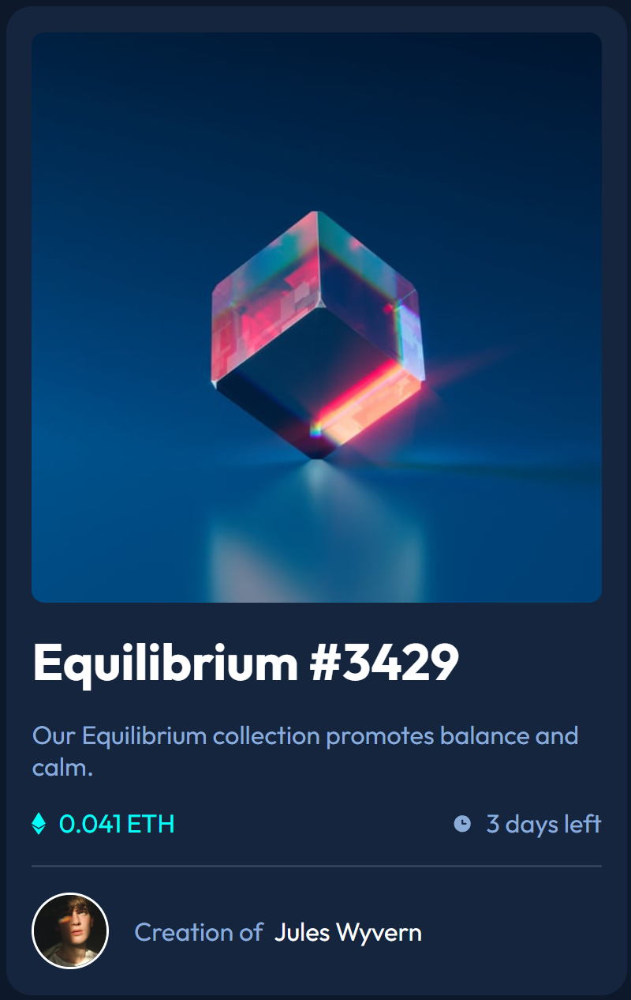
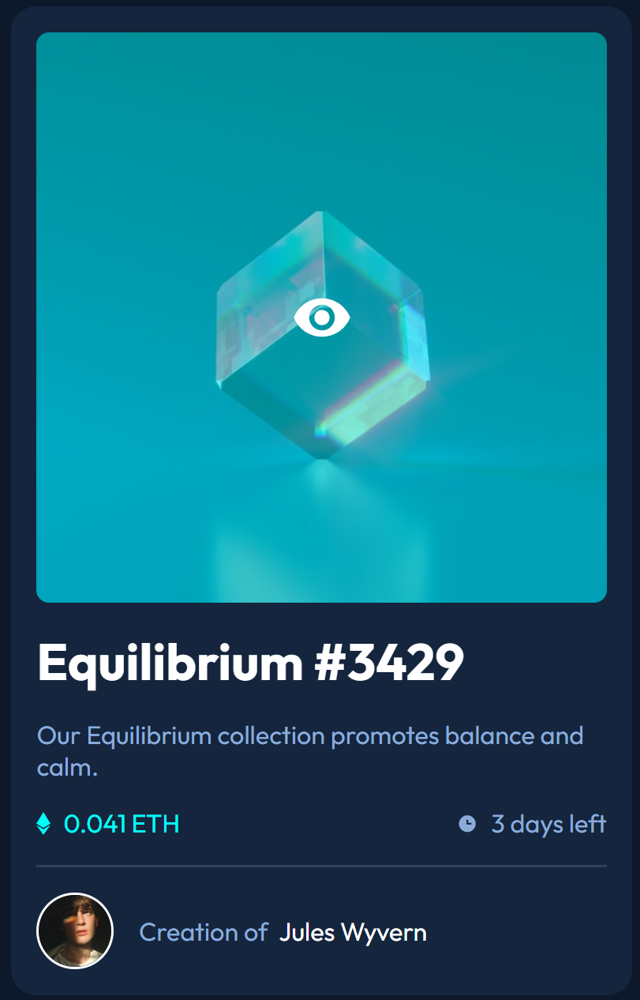

# Frontend Mentor - NFT preview card component solution

This is a solution to the [NFT preview card component challenge on Frontend Mentor](https://www.frontendmentor.io/challenges/nft-preview-card-component-SbdUL_w0U). Frontend Mentor challenges help you improve your coding skills by building realistic projects. 

## Table of contents

- [Overview](#overview)
  - [The challenge](#the-challenge)
  - [Screenshot](#screenshot)
  - [Links](#links)
- [My process](#my-process)
  - [Built with](#built-with)
  - [What I learned](#what-i-learned)
  
## Overview

### The challenge

Users should be able to:

- View the optimal layout depending on their device's screen size
- See hover states for interactive elements

### Screenshot






### Links

- Solution URL: [https://github.com/hrong1/NFT-preview-card-component](https://github.com/hrong1/NFT-preview-card-component)
- Live Site URL: [https://hrong1.github.io/NFT-preview-card-component/](https://hrong1.github.io/NFT-preview-card-component/)

## My process

### Built with

- Semantic HTML5 markup
- CSS custom properties
- Flexbox
- Mobile-first workflow
- [React](https://reactjs.org/) - JS library
- [Sass](https://sass-lang.com/)

### What I learned

Learn `Sass` and `React`, use it to build the page

```html
<body>
  <div id="root"></div>
  <script type="module" src="/src/main.jsx"></script>
</body>
```
```scss
.preview {
    display: flex;
    flex-direction: column;
    background-color: var(--color-blue-900);
    padding: var(--spacing-unit);
    margin: var(--spacing-unit);
    border-radius: var(--border-radius-card);
    gap: var(--spacing-unit);
    max-width: 90%;

    &__img {
        max-width: 100%;
        height: auto;
        display: block;
    }

    &__image-container {
        overflow: hidden;
        position: relative;
        border-radius: var(--border-radius);
        cursor: pointer;
    }

    &__image-container::before {
        content: '';
        background-image: url('../images/icon-view.svg');
        position: absolute;
        background-color: hsl(from var(--color-cyan-400)h s l / 50%);
        width: 100%;
        height: 100%;
        top: 0;
        left: 0;
        background-repeat: no-repeat;
        background-position: center;
        opacity: 0;
        transition:opacity var(--animation-time) ease;
    }

    &__image-container:hover::before {
        opacity: 1;
    }

    &__content {
        display: flex;
        flex-direction: column;
        gap: var(--spacing-unit);
        padding-bottom: var(--spacing-unit);
        border-bottom: var(--bottom-line) solid var(--color-blue-800);
    }

    &__title {
        color: var(--color-white);
    }

    &__description,
    &__time-data,
    &__author-info {
        color: var(--color-blue-500);
    }

    &__title:hover,
    &__author-name:hover,
    &__time-data:hover {
        color: var(--color-cyan-400);
        cursor: pointer;
    }

    &__data,
    &__eth,
    &__time {
        display: flex;
        justify-content: space-between;
        align-items: center;
        gap: var(--spacing-sm);
    }

    &__eth-data {
        color: var(--color-cyan-400);
    }

    &__author {
        display: flex;
        align-items: center;
        gap: var(--spacing-unit);
    }

    &__avatar {
        width: var(--avatar-size);
        height: var(--avatar-size);
        border: var(--bottom-line) solid var(--color-white);
        border-radius: 50%;
    }

    &__author-name {
        color: var(--color-white);
    }

    @media (min-width: 50rem) {
        width: var(--card-width);
    }
}
```
```js
function App() {
    return (
        <section className='preview'>
            <div className="preview__image-container">
                
            </div>
            <div className='preview__content'>
                <h1 className='preview__title'>
                    {cardData.title}
                </h1>
                <p className='preview__description'>
                    {cardData.description}
                </p>
                <div className='preview__data'>
                    <div className='preview__eth'>
                        
                        <span className='preview__eth-data'>
                            {cardData.price}
                        </span>
                    </div>
                    <div className='preview__time'>
                        
                        <span className='preview__time-data'>
                            {cardData.timeRemaining}
                        </span>
                    </div>
                </div>
            </div>
            <div className='preview__author'>
                
                <span className='preview__author-info'>
                    Creation of &nbsp;
                    <span className='preview__author-name'>
                        {cardData.authorName}
                    </span>
                </span>
            </div>
        </section>
    );
}

export default App;
```

## Acknowledgments

Use Gemini Pro 2.5 for the `Sass` and `React` set up
